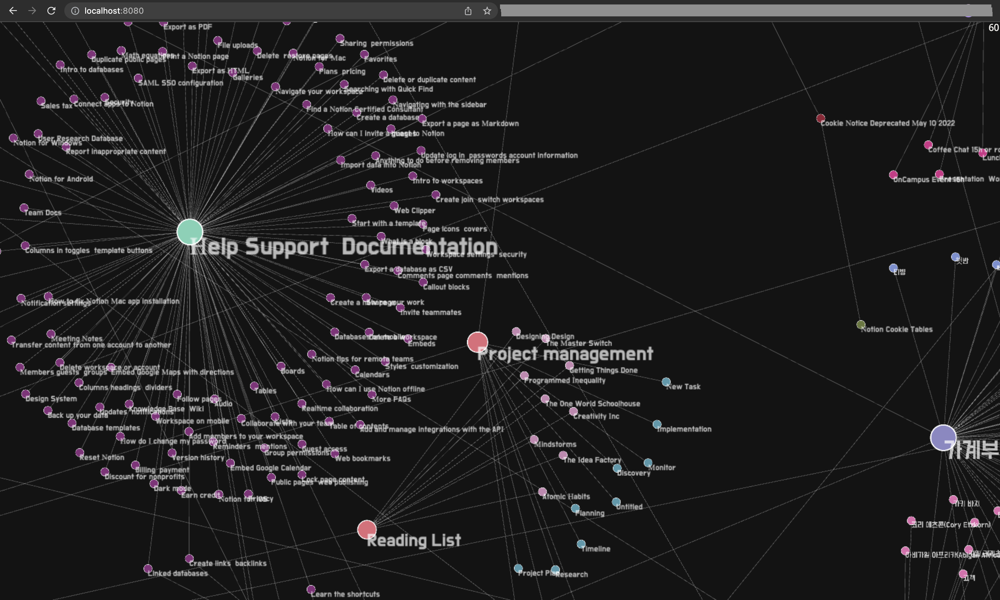

# `@graphcentral/graph`

_Note: this library is still in its early stage. Lots of rooms for improvement._

`@graphcentral/graph` focuses on performant graph layout and visualization on browser by leveraging WebGL and Webworker. As of now, only static force layout is supported.

## Demo

👉 https://graphcentral.github.io/graph

## What you can get

Example of a knowledge graph of Notion Help docs:

## How to

As of now, visit `packages/test` for a sample code using `@graphcentral/graph`. More docs, and interactive demo to come (contributions are most welcome).
